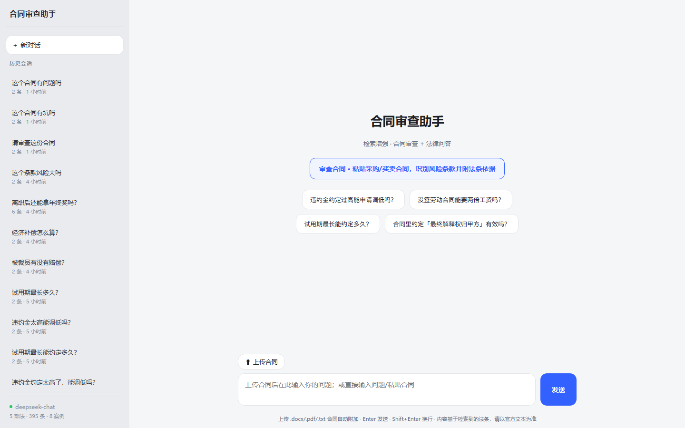
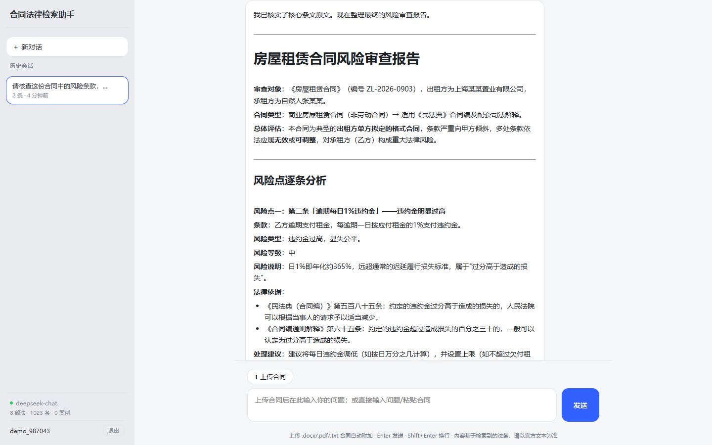

# 智能合同审查 RAG Agent

上传合同 → 自动审查风险条款 → 逐条给出真实法条依据 → 一键导出修订版 Word；也能直接提问法律问题，基于官方法律原文作答。语料全部来自官方原文，引用经反幻觉校验、绝不编造。

---


## 1. 功能特性

- **检索增强的合同审查**：识别违约金过高、格式条款免责、竞业限制无补偿等真实风险，逐条给出可追溯的法条依据。
- **法律问答**：针对劳动、合同、买卖等法律问题提问，基于检索到的官方法条回答。
- **反幻觉引用校验**：答案里每处「《法律名》第X条」都从文本中抽取并逐一核对是否存在于语料，核不过就纠错重写，最后追加 ✅/⚠️ 脚注，绝不静默放行编造引用。还堵了两个盲区：① 识别「民法典585条」这类无书名号的紧凑写法（只认已知法律名，不误抓正文条款）；② 对「条号真实但复述内容与原文不符」的引用做内容忠实度检查，如实提示 ⚠️ 请人工核对。
- **修订版导出**：审查完一键生成修订版合同——只改写已识别且可给真实依据的风险条款，其余一字不改，附「原条款 / 修订后 / 依据」修改说明表，导出为 .docx。
- **确定性评测**：带金标法条的埋点合同测引用召回率，指标全确定性、可复现，当前基线 risk_recall 91% · article_recall 90%（--runs 3，2026-08）。
- **多轮对话 + 会话持久化**：前端可复制 / 修改 / 重新生成消息，SQLite 落盘会话历史，重启不丢。
- **多用户登录与会话隔离**：用户名+密码（argon2 哈希）+ JWT 登录；会话按用户隔离互不可见，跨用户读不到、改不到、删不到他人合同。开放注册 + 初始用户，历史匿名会话启动时自动迁移到初始用户名下。

---

## 2. 效果演示





```
"上传《房屋租赁合同》→ 请审查这份合同"
   └─ agent 循环（while + function calling）
        ├─ 识别风险条款：押金一律不退 / 甲方单方免责 / 违约金过高
        ├─ retrieve("格式条款 免除责任 无效")    → 民法典497条
        ├─ retrieve("免责条款 故意 重大过失")    → 民法典506条
        ├─ retrieve("违约金 过分高于损失 调整")  → 民法典585条 + 通则解释65条
        └─ 答案：逐条风险报告，每条引真实法条
           └─ 引用校验：所有引用逐条核对语料存在（反幻觉）
```

---

## 3. 快速开始

```bash
pip install -r requirements.txt            # 清华镜像
python scripts/download_model.py           # 拉 bge 模型到 models/
python -m core.chunking                    # 生成 chunks.json（语料已入库可跳过）

# 复制 .env.example 为 .env，填入 DEEPSEEK_API_KEY
python cli.py "试用期一般多久"             # agent 端到端（CLI）

# ---- Web（前后端分离）----
cd frontend && npm install && npm run dev   # 前端 5173，/api 代理到 8000
python main.py                              # 后端 API 在 127.0.0.1:8000

# 演示（单进程）：
cd frontend && npm run build && python main.py   # → 开 http://127.0.0.1:8000

# 首次启动会自动建初始用户（INIT_USERNAME/INIT_PASSWORD，未设则生成随机密码并打印），
# 并把历史未归属会话迁移到其名下；也可直接在前端注册新账号。
```

---

## 4. 架构 / 设计

### 检索：向量 + BM25 双路，RRF 融合

- **向量（bge-small-zh）**：语义联想，"换说法"也懂；短口语查询时噪声混入。
- **BM25（jieba 分词）**：词面精确匹配，"仲裁时效/经济补偿"一字不差；不懂同义改写。

RRF 只依赖排名不依赖分数（两路分数量纲不同不可比），一个 chunk 在任一单路排靠前融合分就高：

```
fusion_score(i) = Σ_source 1 / (rrf_k + rank(source, i))   # 典型 rrf_k = 60
```

**两条可选增强**（都不改动默认行为）：
- **相邻法条上下文扩展**（默认开启）：命中一条后把同法相邻条（序数 ±1）也拼进给 LLM 的上下文——法律条文高度关联（如 585 违约金常要和 584/586 配套引用），单条 chunk 里 LLM 看不到邻居。主命中 labels/trace 不受影响。
- **reranker 精排**（P1，默认关闭）：设置 `RERANK=1` 且安装 `BAAI/bge-reranker-base` 后，对 RRF 融合的 top-20 用 bge-reranker 打分取 top-5；模型不可用则静默回退 RRF。

### agent 循环

一个while 循环（`agent/loop.py`），每一步显式、可打断、可打印 trace：
**透明**（trace 记录每轮工具调用与查询改写过程）、**可控**（`max_rounds` 硬上限防无限检索）。

**三个工程化增强**：
- **反思/自查循环**：答案生成后先 `verify_citations` 校验；仅当存在「条号不存在 / 张冠李戴」(invalid)
  时才带反馈让 agent 按 JSON 重写，再校验，至多 `REFLECT_MAX_ROUNDS` 轮（`response_format=json_object`
  强约束，解析 `fixed_answer`）。刻意**不为 suspect（条号真但复述偏离）触发反思**——真实运行 agent
  已很少编造，suspect 又多源于 `check_faithfulness` 对结构化答案（表格/列表）的误报，为它调 LLM 重写
  性价比低；这类只由 `annotate` 如实标注 ⚠️，不静默通过、也不烧 token。反思轮次记入 trace，
  修复率由 `eval_reflection.py` 量化。
- **长会话上下文管理**（`agent/context.py`）：多轮 history 超上限时，把最旧轮次压成一条
  「对话摘要」（`MAX_HISTORY_MESSAGES`/`KEEP_RECENT_MESSAGES` env 可调），再接最近若干轮；
  待审查合同走独立注入，永不被裁剪。短会话零影响。
- **工具注册表 + 结构化输出**（`agent/tools.py`）：工具做成 `TOOL_SCHEMAS`/`TOOL_EXECUTORS`
  注册表，新增工具零改动 loop。第二个工具 `lookup_article` 按「法律名+条号」从语料精确查一条
  法条原文（数据真实不虚构），供反思阶段复核可疑引用，与 `check_faithfulness` 形成闭环。


### Web 架构：前后端分离 + SQLite 持久化

- 后端 FastAPI 只出 JSON（`/api/*` + CORS），前端独立 Vite 工程。开发时 Vite proxy 免 CORS；演示时托管 `frontend/dist/` 单进程运行。markdown 渲染先 escapeHtml 防 XSS 再逐行渲染。
- SQLite 落盘会话（标准库 `sqlite3`），历史侧栏重启不丢；公开接口不变，agent 核心零改动。
- 安全：前端 `escapeHtml` 防 XSS，API key 只存 `.env`（gitignored），且 `.env` 直接覆盖而非 `setdefault`，避免 shell 环境变量污染配置。


## 5. 目录结构

```
corpus/                 # 语料 + 派生索引（8 部官方原文，1023 条）
core/                   # 检索与引用核心
  chunking.py           # 一条法条 = 一个 chunk
  embeddings.py         # bge-small-zh-v1.5 本地向量化（零网络依赖）
  retriever.py          # FAISS 向量检索（IndexFlatIP）
  bm25.py               # BM25 词法检索（jieba 分词）
  hybrid.py             # 双路 RRF 融合
  citations.py          # 引用校验：抽「《法》第X条」核对语料，反幻觉
  fileparse.py          # 合同上传解析（.docx/.pdf/.txt → 纯文本）
  docx_export.py        # 修订版合同导出 .docx（python-docx）
agent/                  # agent 循环（LLM = DeepSeek）
  llm.py / tools.py / prompts.py / loop.py / revise.py / session.py
sample_contracts/       # 评测埋点合同（4 份，含金标风险点）
scripts/                # 验收与评测脚本（见第 7 节）
main.py                 # FastAPI 纯 API 后端（/api/* + CORS；演示模式托管前端 dist）
cli.py                  # CLI 入口，与 web 共用 agent.loop.run
frontend/               # Vue 3 + Vite 前端（前后端分离）
data/                   # SQLite 会话库 sessions.db（gitignored）
```

---

## 6. 技术栈 / 依赖

| 层       | 技术                                         |
|----------|----------------------------------------------|
| 检索     | FAISS · BM25 + jieba · RRF                   |
| 向量模型 | bge-small-zh-v1.5（本地，零网络依赖）        |
| Agent    | while 循环 + OpenAI function calling         |
| LLM      | DeepSeek API                                 |
| 后端     | FastAPI + Uvicorn + SQLite（标准库 sqlite3） |
| 前端     | Vue 3 + Vite                                 |

---

## 7. 测试 / 验收

```bash
python scripts/verify_retrieval.py         # 检索验收：11/11 命中
python scripts/verify_citations.py         # 引用校验验收：8/8 通过
python -X utf8 scripts/verify_revise.py    # 修订守卫：修订不编造条号（0 未核实）
python -X utf8 scripts/eval_review.py      # 评测：确定性引用召回率（--runs 调重复次数）
```

评测指标（`scripts/eval_review.py`，4 份埋点合同，复用引用校验、无裁判 LLM）：
- **risk_recall**（主指标）：随机单次运行里风险点被引到金标法条的比例
- **article_recall**：金标法条被引到过的比例
- **article_precision**：引用里属于金标的比例

LLM 采样有随机性，故每份跑多轮聚合取均值；金标法条启动时逐一核验必须真实存在于语料，否则拒绝运行。

反思循环评测（`python -X utf8 scripts/eval_reflection.py [--runs N]`）：复用同一批埋点合同，从
`run()` 的 `reflection_stats` 聚合出反幻觉指标——**触发反思率 / invalid 修复率 / 结构化替换率**，
以及反思后 invalid、suspect 残留，顺带重算 risk_recall 证明反思不损害检索召回。
当前基线（--runs 3）：**反思触发率 17% · invalid 修复 50% · 反思后 invalid 均值 0.08 ·
risk_recall 94%**。触发率低是设计使然——真实运行 agent 已很少编造条号，反思只对真问题烧 token；
suspect 误报残留均值约 6（句尾引用的忠实度窗口局限）为已知弱项，只标注、不自动重写。
